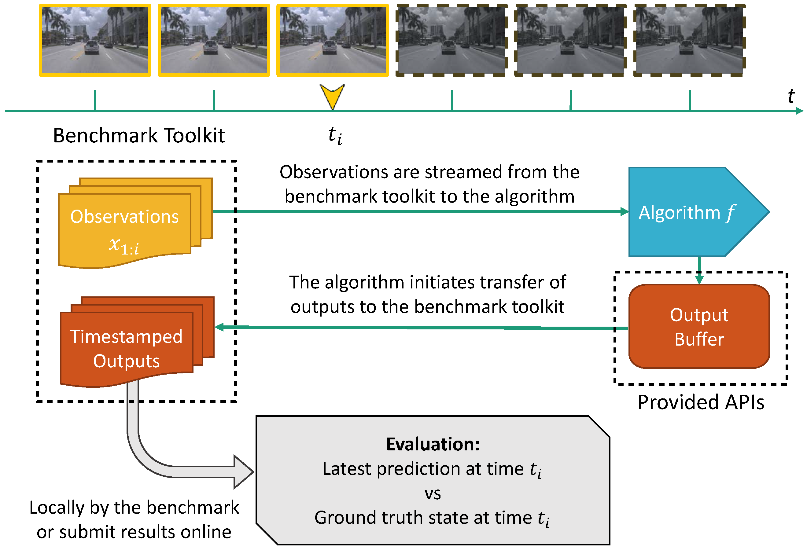

# sap_toolkit

This benchmark toolkit is provided as part of the Streaming Perception Challenge 2021. This toolkit takes care of reading frames from disk and streaming them to your algorithm and also receiving results from your algorithm, in addition to generating the `.json` file required by the challenge website, and can perform local evaluation if annotations are provided in the COCO format. 

For more details on design, check out the [architecture](#architecture) section.

## Installation

You can install the toolkit by using pip:

```
pip install sap_toolkit
```

## Design:

The toolkit consists of two main components:

*  A daemon process to stream frames, receive results and generate output. This must always be running before your application is run.
*  An EvalClient object with an API to communicate with the daemon process.

The motivation behind this design is to decouple the tasks of reading frames from disk, streaming frames at required times, receiving output, etc. from your actual algorithm code. A streaming perception system streams frames in real-time and queries the state of the world at predefined times. Therefore, we cannot run our benchmark toolkit in a post-processing fashion, but do so as a continuously running daemon process. To facilitate modular development, we adopt this design.

## Usage


The benchmark toolkit daemon process can be launched using the following syntax:

```
python -m sap_toolkit.server \
	--data-root <path-to-data> \ 
	--annot-path <path-to-annotations> \
	--overwrite <overwrite-flag> \
	--out-dir <path-to-output-directory>
```

The various parameters are:

- `--data-root`: This provides the root directory of the dataset.
- `--annot-path`: This provides the annotations file in COCO format. It is required for local evaluation. If annotations are not available, this must be provided to be a .json file containing meta-information about the dataset in COCO format (essentially the COCO annotations .json file without the "annotations" key)
- `--overwrite`: Whether to overwrite existing output if present.
- `--out-dir`: Specifies the output directory. 
- `--perf-factor`: (Set by default to 1.0 if not provided). Provides a runtime scaling factor to compensate for difference in hardware. Refer to [this](https://docs.google.com/spreadsheets/d/1g5jUAbeNswO-EQHrU9EHYpTT2XYCbepeL9KFEAVehMo/edit#gid=0) spreadsheet for a list of performance conversion factors based on your GPU.

    This also launches a command-line interface (CLI) that supports the following options:

- `log`: View server log
- `evaluate <filename>`: If annotations are provided, run a local evaluation and generate evaluation metrics for the provided .json file with the given filename.
- `help`: show help

### API:

The `sap_toolkit` provides an EvalClient class that can be used in your application/algorithm to communicate with the benchmark toolkit.

The API consists of the following  calls:

1. `sap_toolkit.EvalClient(config, state=None, verbose=True)`: Constructor for the EvalClient object. Can optionally accept a state object to initialize with a given state, which can be obtained by calling the `get_state()` method of another EvalClient object (useful in multiprocessing applications). 
2. `EvalClient.request_stream(seq)`: Requests the server to stream a particular sequence.
3. `EvalClient.get_frame(fid=None)`: If fid is None, returns the latest available (fid, frame) tuple where `frame` is a numpy array representing the image. When fid is provided, returns the frame corresponding to it, if available at the current time.
4. `EvalClient.send_result_to_server(bboxes, scores, labels)`: Send a result to the toolkit. This accepts three arguments of sizes Nx4, Nx1, Nx1, which are the bounding box co-ordinates (x1, y1, x2, y2) representing the bounding box left-top and right-bottom points, bounding box scores and labels.
5. `EvalClient.stop_stream()`: Requests server to stop processing the current stream. This also writes intermediate timestamped output.
6. `EvalClient.close(filename='results.json')`: Closes the evaluation client object, processes the generated intermediate output files and creates the `results.json` output file. Should only be called when all processing is done.
7. `EvalClient.get_state()`: Returns the state of the current evaluation client object (which stores info such as currently processing stream and so on). Useful for multiprocessing applications.
8. `EvalClient.get_stream_start_time()`: Get the time the current stream's first frame was received.

For example applications using the sap_toolkit, check out the baseline examples [here](https://github.com/karthiksharma98/sap-starterkit).


## Architecture

The streaming perception task requires a perception system to receive frames at a constant frame rate. Outputs from the system must also be timestamped for evaluation. This toolkit takes care of these tasks. 

A diagram explaining how the toolkit works is shown below:



1. When the benchmark toolkit is run, it launches two additional processes, one for streaming frames and one for receiving results from the client.
2. When an `EvalClient` object is created in your algorithm, it communicates with the server. When it requests a stream for a specific sequence (sequence here refers to a single video in the dataset), all the images in the sequence are first loaded to shared memory. Shared memory is used for inter-process communication as it is the fastest method with negligible IPC latency.
3. The toolkit then begins streaming the frames to your application as they become available (based on the current clock value).
4. Your algorithm can at any time send its result to the toolkit. This is handled asynchronously, so your algorithm/application doesn't have to wait until sending of the result is completed. When the toolkit receives the result, it timestamps it and stores it.
5. When your algorithm requests to stop the current stream, the timestamped results for a particular sequence are written to an intermediate output file.
6. When your algorithm requests to close the EvalClient object using the `close()` call, all the intermediate output is converted to the COCO format (result for a particular query image) and written out to a .json file. This .json file is what is uploaded to the challenge website.